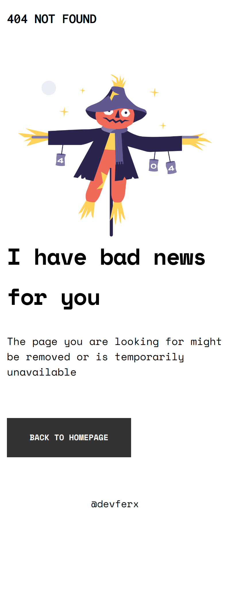
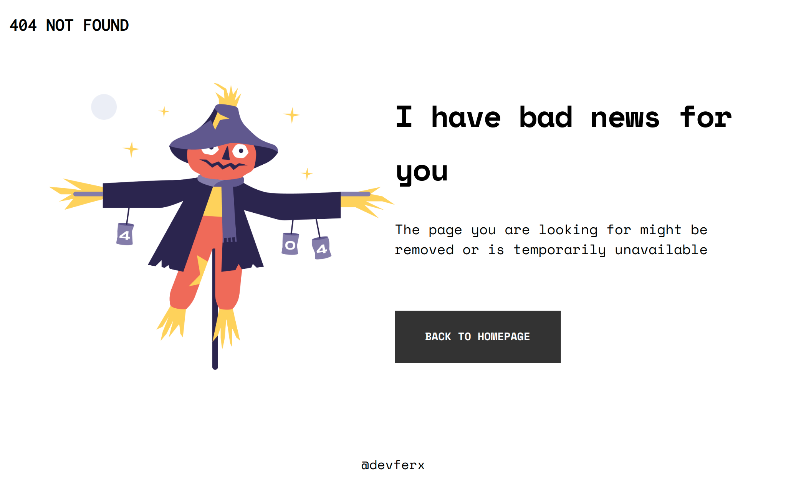

<!-- Please update value in the {}  -->

<h1 align="center">404 Page Not Found</h1>

   Solution for a challenge from  <a href="http://devchallenges.io" target="_blank">Devchallenges.io</a>.

  <h3>
    <a href="https://devferx.github.io/404-not-found/">
      Demo
    </a>
     | 
    <a href="https://devchallenges.io/challenges/wBunSb7FPrIepJZAg0sY">
      Challenge
    </a>
  </h3>

## Overview

### Built With

- HTML 5
- CSS 3
- Google Fonts

## Contact

- GitHub [@your-username](https://github.com/devferx)
- Twitter [@your-twitter](https://twitter.com/devferx)
